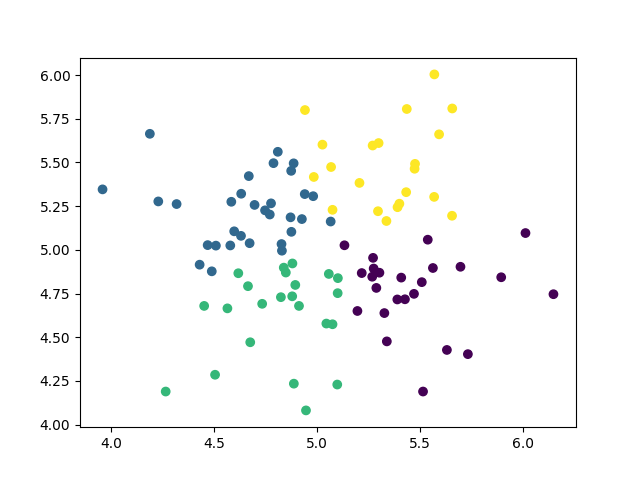
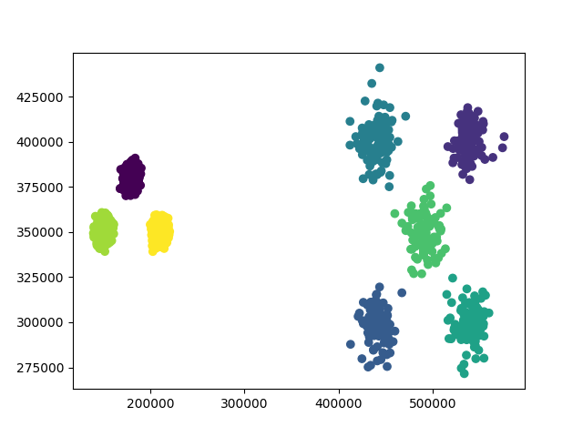

# kmeans_clustering

Clustering datasets of points in a 2D space, using the k-means algorithm.
K-means++ is also implemented and gives a better result for the unbalance.txt dataset.
The standard k-means works well enough for the normal.txt dataset.
Includes a short visualize.py script and images with the clustering results.

### Result for the normal.txt dataset
---

### Result for the unbalance.txt dataset
---

